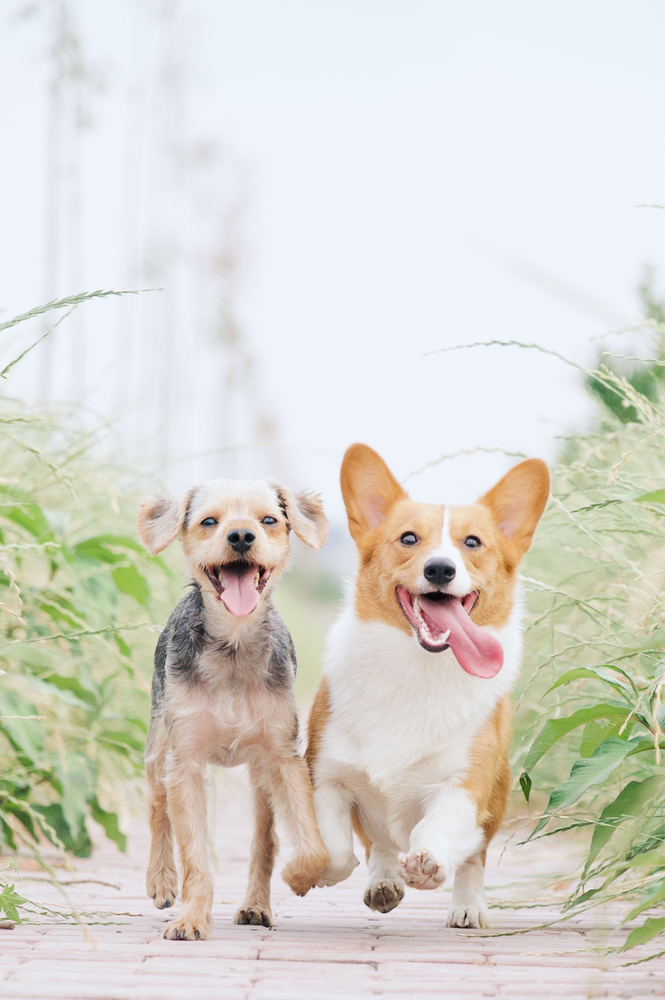
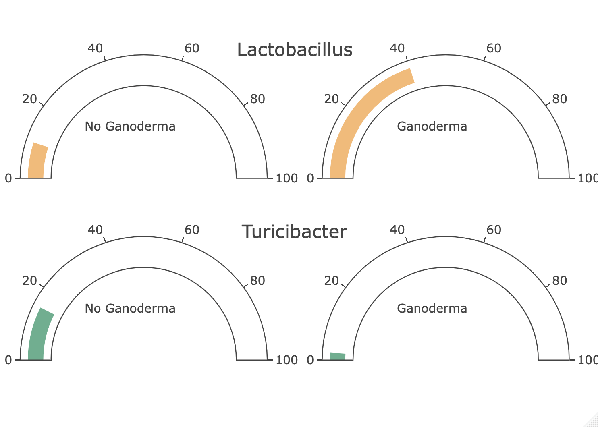

```{r , echo=FALSE, include=FALSE}
knitr::opts_chunk$set(echo = TRUE)
# load data in 'global' chunk so it can be shared by all users of the dashboard
library(phyloseq)
library(ggplot2)
library(shinydashboard)
library(devtools)
library(flexdashboard)
library(kableExtra)
library(microbiome)
library(plyr)
library(plotly)
library(stringr)
library(microbiomeutilities)
library(microViz)
library(gtools)
library(ggpubr)
setwd("/Users/dvarelat/Documents/SIWA/Pets_flex")
source("functions.R")
input_dir = "Input_data/"
ODLEPobj <- readRDS(paste0(input_dir, "PhyloseqObject_pets.rds"))
df_c <- read.csv(paste0(input_dir, "bench_cecum.csv"))


levels = c("control", "gano5", "gano10", "gano15")
sample_data(ODLEPobj)$Group <- factor(sample_data(ODLEPobj)$Group, levels=levels)
sample_data(ODLEPobj)$Timepoint <- factor(sample_data(ODLEPobj)$Timepoint,
                                          levels=c("Before", "After"))
sample_data(ODLEPobj)$SampleDog <-
  paste0(
    sample_data(ODLEPobj)$DOG,
    "-",
    sample_data(ODLEPobj)$SampleID %>% stringr::str_remove("F-M")
  )
sample_data(ODLEPobj)$DogGroup <-
  paste0(
    sample_data(ODLEPobj)$DOG,
    "-",
    sample_data(ODLEPobj)$Group
  )
phylo_before <- subset_samples(ODLEPobj, Timepoint ==  "Before")
phylo_after <- subset_samples(ODLEPobj, Timepoint ==  "After")
# 
phylo_before_rel <- microbiome::transform(phylo_before, "compositional")
phylo_after_rel <- microbiome::transform(phylo_after, "compositional")

relative <- microbiome::transform(ODLEPobj, "compositional")
p_times <- list(After=phylo_after, 
                Before=phylo_before)
phyloseq_relative <- relative

genus_to_keep <- function(phyloseq_relative, N = 12) {
  ps.com.gen <-microbiomeutilities::aggregate_top_taxa2(phyloseq_relative, level = "Genus", top= N)
  keep_genus <-
    as.list(as.data.frame(phyloseq::tax_table(ps.com.gen))$Genus)
  keep_genus <- keep_genus[keep_genus != "UNKNOWN"]
  keep_genus <- keep_genus[keep_genus != "Other"]
  return(keep_genus)
}
grouped <- aggregate_taxa_siwa(phyloseq_relative, "Genus")
melted <- psmelt(otu_table(grouped, taxa_are_rows = TRUE))
metadata <- sample_data(phyloseq_relative)
melted$SampleID <- melted$Sample
melted <- dplyr::left_join(melted, metadata, by="SampleID")
melted$SampleDog <- as.factor(melted$SampleDog)
melted$DogGroup <- as.factor(melted$DogGroup)

keep_genus_after <- genus_to_keep(phylo_after_rel)
keep_genus_before <- genus_to_keep(phylo_before_rel)

dict_keep_genus <- list(After=keep_genus_after,  Before=keep_genus_before)
```


```{r picture, echo=FALSE, include=TRUE, fig.align="center", out.height="60%", out.width = "90%"}
#{#center .class width=50% height=80%}


cvi_colours = list(
  cvi_siwa = c("#03343a", "#4e8e74","#f99b35",  "#e5c217",
               "#075b44", "#f9b870", "#f7e76d",
                  "#017fb1", "#5cb08e" , "#fcd8b6", "#fcf5cd", "#ABF4D4",
               "#8CDBF4","#F7927F"),

  alpha_colors = c( "#075b44",  "#017fb1"),
  bad_good_stool = c( "#f9b870","#f9b870", "#5cb08e"),
  groups_pastel = c( ),
  groups=c("#4e8e74", "#035060", "#f99b35", "#BC8808")
)

cvi_palettes = function(name, n, all_palettes = cvi_colours, type = c("discrete", "continuous")) {
  palette = all_palettes[[name]]
  if (missing(n)) {
    n = length(palette)
  }
  type = match.arg(type)
  out = switch(type,continuous = grDevices::colorRampPalette(palette)(n),discrete = palette[1:n]
  )
  structure(out, name = name, class = "palette")
}

scale_color_cvi_d = function(name) {
  ggplot2::scale_colour_manual(values = cvi_palettes(name, type = "discrete"))
}
scale_fill_cvi_d = function(name) {
  ggplot2::scale_fill_manual(values = cvi_palettes(name,type = "discrete"))
}

```


Ganoderma lucidum as a modulator of the canine gut microbiome
===================================== 

Ganoderma lucidum (Reishi) is a fungus rich in Beta-glucans and triterpenoids called ganoderic acids.  Both Beta-glucans and ganoderic acids have shown immunoprotective activity in a variety of animal models, including dogs. The purpose of this study was to investigate whether a ganoderma dietary supplement also impacted the composition of the microbiome in dogs receiving varying doses of the supplement.  Altea Reishi™ was provided at 4 dosage levels for 28 days, from 0 to 15 mg/kg of body weight, and the resulting changes in microbiome composition were evaluated with the use of 16S amplicon sequencing.  


<!-- Row --> 
-------------------------------------

\newpage

Microbiome composition {data-icon="fa-table"}
===================================== 

<!-- Row --> 
-------------------------------------

The microbiome is a complex community that can change in a variety of ways.  Identifying broad shifts in composition requires methods for evaluating the entirety of the data at the same time.  In principal component analysis (PCA), the sum total of all sequence information for each sample is represented as a single point in a 2 or 3-dimensional space, and samples that cluster together can be seen as more similar in their composition than samples that are far apart

<!-- Row --> 
-------------------------------------

### PCA of fecal samples from dogs receiving 4 levels of Ganoderma (0, 5 mg/kg, 10 mg/kg, 15 mg/kg)

```{r beta, include=TRUE, eval=TRUE, echo=FALSE}
out.bray <-
    ordinate(
      phylo_after, method = "MDS", 
      distance = "bray")
p <- plot_ordination(
    phylo_after,
    out.bray,
    color = "Group",
    axes = c(1, 2),
    justDF = FALSE
  )
df <- p$data
df$Group <- as.factor(df$Group)
plot <- ggplot(df, aes(
    x = Axis.1,
    y = Axis.2,
    color = Group,
    text = paste("Dog:", DOG, "\n", DogGroup) )) +
    geom_point(size=3) +xlab(p$labels$x) + ylab(p$labels$y) + scale_color_cvi_d("groups")

plot
```


\newpage


Taxonomic composition 
===================================== 

<!-- Row --> 
-------------------------------------

Taxonomic profiling of individuals and groups can add context to population-level analyses like PCA, revealing microbial trends based on treatment, age, or other variables of interest.

<!-- Row --> 
-------------------------------------

### Top 12 genera from all animals.: timepoint after

```{r , echo=FALSE, out.height="70%", out.width = "90%"}
melted$label <-as.character(if_else(melted$OTU %in% keep_genus_after, melted$OTU, "Others"))
df <- melted[, c("label", "Abundance", "DOG", "Timepoint", "Group")]
df <- df[df$Timepoint == "After",]
df_agg <-aggregate(df$Abundance,
          by = list(df$label, df$DOG,  df$Group),FUN = sum)
colnames(df_agg) <-c("Genus", "DOG","Group", "Abundance")

ggplot(df_agg,
       aes(x = DOG,
           y = Abundance,
           fill = Genus,)) +  geom_bar(stat = "identity", position = "fill") + facet_wrap( ~Group, scales = 'free') + scale_fill_cvi_d("cvi_siwa") + theme(axis.text.x = element_text(angle = 60, hjust = 1))

```


### By groups within the same timepoint:

```{r , echo=FALSE}
ggplot(df_agg,
       aes(x = Group,
           y = Abundance,
           fill = Genus,)) +  geom_bar(stat = "identity", position = "fill") +  scale_fill_cvi_d("cvi_siwa") + theme(axis.text.x = element_text(angle = 60, hjust = 1), text = element_text(size=15))
```


### By timepoint within the same group:

```{r , echo=FALSE, fig.width=10, fig.height=12}
melted$label <-as.character(if_else(melted$OTU %in% keep_genus_after, melted$OTU, "Others"))
df <- melted[, c("label", "Abundance","Timepoint", "Group")]
df_agg <-aggregate(df$Abundance,
          by = list(df$label, df$Timepoint,  df$Group),FUN = sum)
colnames(df_agg) <-c("Genus", "Timepoint","Group", "Abundance")
ggplot(df_agg,
       aes(x = Timepoint,
           y = Abundance,
           fill = Genus,)) +  geom_bar(stat = "identity", position = "fill") +  scale_fill_cvi_d("cvi_siwa") + theme(axis.text.x = element_text(angle = 60, hjust = 1), text = element_text(size=15)) + facet_wrap( ~Group, scales = 'free')

```


Significant features when comparing Ganoderma-treated animals and controls.
===================================== 

Differential abundance analysis is an important process for identifying bacteria that are statistically higher or lower in one group compared with others.  Linear discriminant analysis (LDA) is a statistical method that identifies sequences that account for the most variation between groups.

<!-- Row --> 
-------------------------------------

```{r , echo=FALSE, include=TRUE, fig.width=12, fig.height=4}
bacterias <- c("Lactobacillus", "Megasphaera","Prevotella","Turicibacter","Peptostreptococcaceae-Unknown")
df <- data.frame(
  class = c("Ganoderma","Ganoderma","Ganoderma", "No-Ganoderma","No-Ganoderma"),
  names=bacterias,
  len = c(4, 2.2, 2, 2.5, 3)
  )
df$class <- as.factor(df$class)
df$names <-factor(df$names,levels = c("Lactobacillus", "Megasphaera","Prevotella","Peptostreptococcaceae-Unknown","Turicibacter"))

pl <- ggplot(df, aes(x=names, y = len, fill = class)) +
  geom_bar(stat = "identity") + xlab("")+ ylab("LDA Score")+
  coord_flip() + scale_fill_cvi_d("alpha_colors") + theme(text = element_text(size=15)) 
pl
```

<!-- Row --> 
-------------------------------------

{#id .class width=90% height=50%}

SIWA: Additional analyses
===================================== 

Though not relevant to the effects of Ganoderma on the microbiome, there are many other analyses that can add value to studies of gut health and the microbiome.  Some are standard in metagenomics, while we have developed others in response to our needs and those of our customers.


### Diversity and richness in the microbial community

There are many dietary and environmental variables that can affect the diversity and stability of the microbiome, predisposing the community to dysbiosis and overgrowth of opportunistic bacteria.  Alpha diversity metrics summarize the structure of an ecological community with respect to its richness (number of taxonomic groups), evenness (distribution of abundances of the groups), or both in the case of the Shannon Index.


```{r, echo=FALSE, warning=FALSE, out.height="80%", out.width = "90%",  fig.align="center"}
plot_alpha <- readRDS(file=paste0(input_dir, "plot_div.rds"))

plot_alpha + scale_color_cvi_d("alpha_colors")
```


\newpage


<!-- Row --> 
-------------------------------------

### Correlating experimental outcomes with traits of interest

A critical component of a good research study is the ability to relate experimental outcomes with phenotypic changes we hope to see.  Fecal scores, body condition, blood parameters, or behavior, just to name a few.  SIWA places a strong emphasis on relating microbial patterns and specific species to traits of interest.  Robust correlations between study features and outcomes that matter to animals and pet owners are the foundation of our platform.  


```{r, echo=FALSE, out.height="20%", out.width = "90%", fig.align="center"}
df_perf <- read.csv(file=paste0(input_dir, "performance.csv"))
ps <- ggplot(df_perf, aes(x=clr_t, y=FCRbefore, color=I("#606060"))) + 
  geom_point(show.legend = FALSE) + geom_smooth(method=lm, se=TRUE, color="#075b44") + 
  xlab("Transformed abundance of Lactobacillus spp") + ylab("IL1B expression") + 
  theme_light() + theme(legend.position = "none")
ps
```

### Benchmarking SIWA Microbial Health Score 1 against the broader community

```{r plot1, warning=FALSE, echo=FALSE, out.height="35%", fig.align="center"}
cs = list(list(0, "#03343a"), list(1, "#f7e76d"))
df_c$quant <- gtools::quantcut(abs(df_c$ratio1LOG), 10, label = FALSE)
p <- plot_ly(data=df_c) %>%
  add_trace(x = ~ratio1LOG, y= 0.5, type = "box", boxpoints = "none",showlegend=FALSE,
            orientation='h', fillcolor="#035060", 
            marker = list(symbol = "square-dot", color="#035060"),
            line = list(color = "#4e8e74",width = 2), 
            hoverinfo='none') %>%
  add_trace(type="scatter", mode="markers",  hoverinfo='none',showlegend=FALSE,
            x=~ratio1LOG, y=rnorm(nrow(df_c), 0, 0.05), 
            marker=list(color = ~quant, size=10, 
                        autocolorscale=F, colorscale = cs)) %>%
  add_trace(name="Group A",type="scatter", mode="markers",
            x=0, y=0.55, textposition = "bottom center",hoverinfo='none',
            marker=list(color = "#017fb1", size=15, symbol="triangle-down")) %>%
  #add_annotations(x=0,y=0.6, text="Group A") %>% 
  add_trace(name="Group B",type="scatter", mode="markers+text",
            x=3, y=0.55, 
            marker=list(color = "#e5c217", size=15, symbol="triangle-down")) %>% 
  # add_annotations(x=3,y=0.6, text="Group B", ax = 50, ay = -40 ) %>% 
  layout(xaxis = list(title = 'SIWA Microbial Health Score 1',
                      showgrid = F,
                      zerolinecolor = '#ffff'), 
         legend =  list(orientation = "h",   # show entries horizontally
                     xanchor = "center",  # use center of legend as anchor
                     x = 0.5, y = 1))
p

```


### Mapping SIWA Microbial Health Score 1 against the Bristol Stool Scale

```{r, include=TRUE, warning=FALSE, echo=FALSE}
plot_popo <- readRDS(file=paste0(input_dir, "plot_ploop.rds"))


plot_popo <- plot_popo + scale_color_cvi_d("bad_good_stool") +
  xlab("Stool Type") + ylab("SIWA Microbial Health Score 1") + theme_light()

ggplotly(plot_popo, height=400)

```

